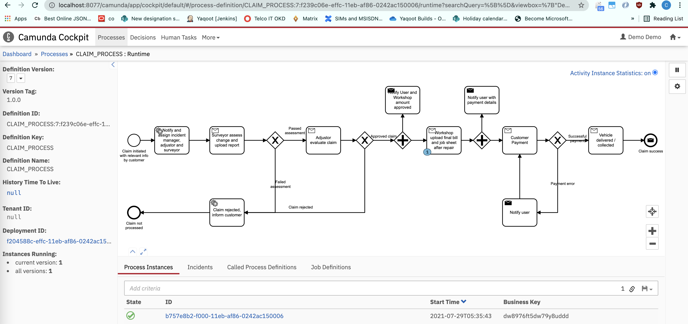

# Camunda POC
## Workflow management

This POC includes Camunda BPMN file to be deployed on a Camunda server, and a node js script to consume topics/events to and from this deployment.
Also included is a Postman collection to send messages to Camunda server to "notify" completion of tasks.

Purpose of this illustration is to show a workflow process for insurance claims starting from *Claim being filed -> Surveyor Assessment -> Adjustor Approval -> Workshop repair completion -> Payment -> Claim success*.
The actual code for above is mocked. The node.js script will consume topics from Camunda deployment, and Postman collection has APIs to provide events to Camunda server.

### **Prerequisites**
- Camunda Modeler application is installed.
- Camunda server deployed and running on URL http://localhost:8077/
- Node.js runtime installed.
- Postman application installed.

### **Deploy Camunda file**
_Assuming Camunda server is deployed on URL http://localhost:8077/ . Change subsequent URLs accordingly._
- Open `Claim_Process.bpmn` (in `camunda_BPMN` folder) in Camunda Modeler application, and click on deploy button.
- Enter Deployment name `Claim_Process` and Camunda server engine URL http://localhost:8077/engine-rest (change as needed)
- Check process definition deployment on Camunda server http://localhost:8077/camunda/app/cockpit/default/#/processes as `CLAIM_PROCESS`

### **Run node js app**
- Install dependencies: `npm install`
- Run following command to start the nodejs app: `node src/claim_process.js`

### **Import Postman collection**
- Go to Postman application and click on Import
- Select file `CLAIMS_POC.postman_collection.json` (in `postman_collection` folder) and import it.

### **Test flow of workflow**
After completing the above steps:
1. Go to postman collection and run the `START CLAIM PROCESS` API.
    - This will initiate the claims workflow.
2. Flow will move to the first task: `Notify and assign incident manager, adjustor and surveyor`. This is an external task, the node.js script will receive this topic event and print an output to console signifying processing of this step. It will then mark it as complete.
3. Flow will now move to next task `Surveyor assess change and upload report`. This is a `receive task` i.e. Camunda will wait for an external call.
    - From postman, call the `SURVEYOR ASSESSMENT` API.
    - This will mock completion of this task.
    - To check failure case, pass the `value` in post body in Postman API as false. This will lead to end of workflow, with an unsuccessful response.
4. Flow will move to the `Adjustor evaluate claim` task.
    - From postman, call the `ADJUSTOR ASSESSMENT` API.
    - This will mock completion of this task.
5. Now the `Notify User and Workshop amount approved` will be called _parallelly_ (logged in nodejs app console) along with flow moving to `Workshop upload final bill and job sheet after repair`.
    - From postman, call the `WORKSHOP FINAL UPDATE` API.
    - This will mock completion of this task.
6. Similar to previous step, `Notify user with payment details` step will be called _parallelly_ (logged in nodejs app console) and flow will reach `Customer Payment` task, waiting for customer to complete payment.
    - From postman, call the `CUSTOMER PAYMENT CALLBACK` API.
    - This will mock successful payment.
    - To check failure case, pass the `value` in post body in Postman API as false. This will pass flow to `Notify user` task, consumed by the nodejs app, which will log to console and send flow back to the `Notify user with payment details` task.
7. After mocking successful payment, flow will move to the `Vehicle delivered / collected` task.
    - From postman, call the `WORKSHOP FINAL UPDATE` API.
    - This will mock completion of this task.
8. Finally, flow will reach the end event, which will be consumed in the nodejs app. It will display a final console message, and workflow will be completed.
